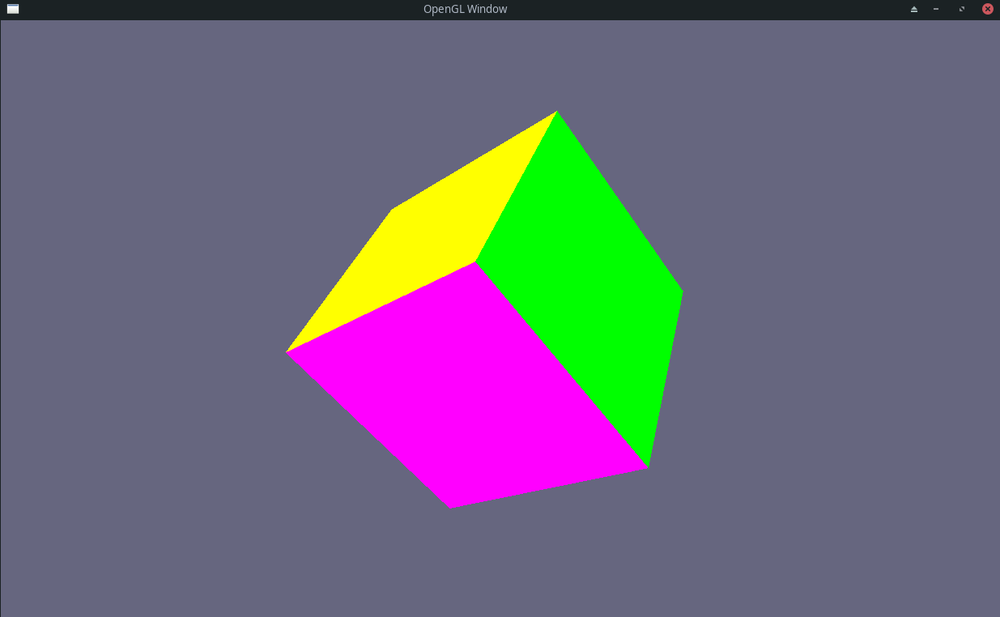

# FirstGameEngine

A modular 3D game engine built from scratch in **C++** using **OpenGL**, **GLFW**, and **GLEW**.

The engine is designed with modularity in mind, separating reusable engine code from game-specific logic. Each engine subsystem is compiled as its own static library, making the project easy to extend and maintain.



---

## Features

- Modern OpenGL rendering pipeline
- Modular engine architecture
- Scene and entity system
- First-person free camera
- Shader abstraction
- Texture loading
- OBJ mesh support
- Asset management system
- Keyboard and mouse input handling
- Delta-time movement
- Physics module *(work in progress)*
- AABB collision primitives
- CMake build system
- Static library separation for engine modules

---

## Project Structure

```text
FirstGameEngine/
├── core/
│   ├── AssetManager/
│   ├── Collision/
│   ├── Entity/
│   ├── Event/
│   ├── Game/
│   ├── Graphics/
│   │   ├── Camera/
│   │   ├── Mesh/
│   │   ├── Renderer/
│   │   │   ├── Shader/
│   │   │   ├── Texture/
│   │   │   ├── VAO/
│   │   │   ├── VBO/
│   │   │   └── EBO/
│   │   └── lib/
│   ├── Input/
│   ├── Logic/
│   ├── Physics/
│   ├── Scene/
│   └── Window/
│
├── gameApp/
│   ├── Camera/
│   ├── models/
│   ├── shader/
│   ├── textures/
│   ├── GameLogic.cpp
│   └── main.cpp
│
├── CMakeLists.txt
└── README.md
```

---

## Architecture

The engine is composed of independent modules that communicate through well-defined interfaces.

```
Application
      │
      ▼
    Game Loop
      │
 ┌────┴──────────────────────────┐
 │                               │
 ▼                               ▼
Input                         Scene
 │                               │
 ▼                               ▼
Events                      Entities
 │                               │
 └──────────────┬────────────────┘
                ▼
            Renderer
      ├── Shader
      ├── Texture
      ├── Mesh
      ├── VAO
      ├── VBO
      └── EBO
                │
                ▼
             OpenGL
```

Game-specific behavior is implemented by inheriting from the abstract `Logic` interface.

```cpp
class Logic
{
public:
    virtual void onUpdate() = 0;
    virtual void onRender() = 0;
};
```

The engine owns the game loop while the application provides the gameplay implementation.

---

## Rendering

The renderer currently provides abstractions for:

- Vertex Array Objects (VAO)
- Vertex Buffer Objects (VBO)
- Element Buffer Objects (EBO)
- GLSL shader management
- Texture loading
- Mesh rendering
- View and projection matrices

---

## Camera

The sample application includes a free-fly camera.

| Input | Action |
|-------|--------|
| **W / S** | Move forward / backward |
| **A / D** | Strafe left / right |
| **Q / E** | Move down / up |
| **Mouse** | Look around |
| **F** | Toggle cursor capture |
| **ESC** | Exit application |

---

## Asset Management

The engine includes an AssetManager responsible for loading and organizing assets.

Currently supported:

- GLSL shaders
- Textures
- OBJ models

---

## Physics

A dedicated physics module exists for future expansion.

Current functionality includes:

- Physics module
- AABB collision primitives

---

## Input System

The input system tracks multiple key states.

```cpp
enum KeyState
{
    KEY_RELEASED,
    KEY_PRESSED,
    KEY_HELD
};
```

Example usage:

```cpp
Input::isKeyPressed(GLFW_KEY_W);
Input::isKeyHeld(GLFW_KEY_W);

float deltaTime = Input::getDeltaTime();
```

---

## Dependencies

- OpenGL
- GLFW
- GLEW
- GLM
- stb_image
- CMake (3.x or newer)

GLFW and GLEW are included as static libraries under:

```text
core/Graphics/lib/
```

---

## Building

Clone the repository:

```bash
git clone https://github.com/matheusCsousa/FirstGameEngine.git
cd FirstGameEngine
```

Generate build files:

```bash
mkdir build
cd build

cmake ..
make
```

The executable will be generated at:

```text
build/gameApp/fersa
```

---

## Running

From the project root:

```bash
./build/gameApp/fersa
```

---

## Creating a Game

Create a class derived from `Core::Logic`.

```cpp
class MyGame : public Core::Logic
{
public:
    void onUpdate() override;
    void onRender() override;
};
```

Then register it with the engine.

```cpp
#include "core/Game/Game.hpp"
#include "MyGame.hpp"

int main()
{
    Core::GameSpecs specs;

    specs.title = "My Game";
    specs.windowSpec.width = 1280;
    specs.windowSpec.height = 720;

    Core::Game game(specs);

    game.pushLogic<MyGame>();

    game.run();
}
```
